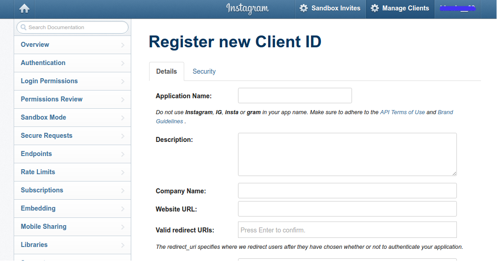
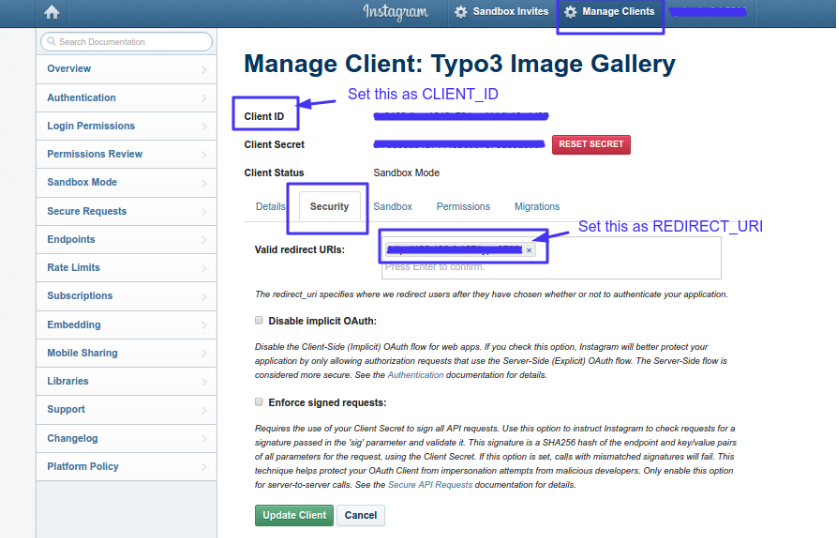
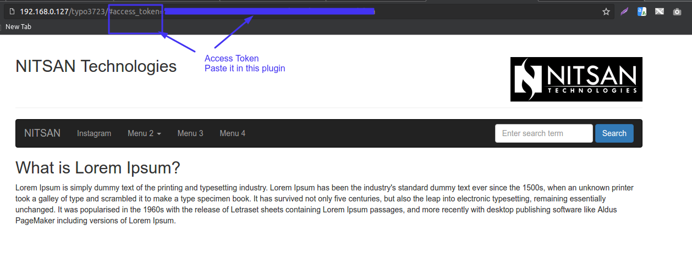

.. ==================================================
.. FOR YOUR INFORMATION
.. --------------------------------------------------
.. -*- coding: utf-8 -*- with BOM.

.. include:: ../../Includes.txt

.. _api-configuration:

Instagram API Configuration
===========================

To activate the Instagram service for your TYPO3 site:
------------------------------------------------------

**Step 1:** Signup with Tour Instagram Account at here `https://www.instagram.com/accounts/login/?next=/developer/ <https://www.instagram.com/accounts/login/?next=/developer/>`_

**Step 2:** *"Register new Client ID"*  at there.

**Step 3:** Go to "Manage Clients"  you will get  *"CLIENT_ID"*,  *"REDIRECT_URI"* from there.

**Step 4:** Replace *"CLIENT_ID"*  and  *"REDIRECT_URI"*  in below URL which you get from there.

`https://www.instagram.com/oauth/authorize?client_id=CLIENT_ID&redirect_uri=REDIRECT_URI&scope=basic+public_content&response_type=token <https://www.instagram.com/oauth/authorize?client_id=CLIENT_ID&redirect_uri=REDIRECT_URI&scope=basic+public_content&response_type=token>`_

**Step 5:** Now you may get *"Access Token"*  in URL. Copy that and Paste it in to this Extension.

