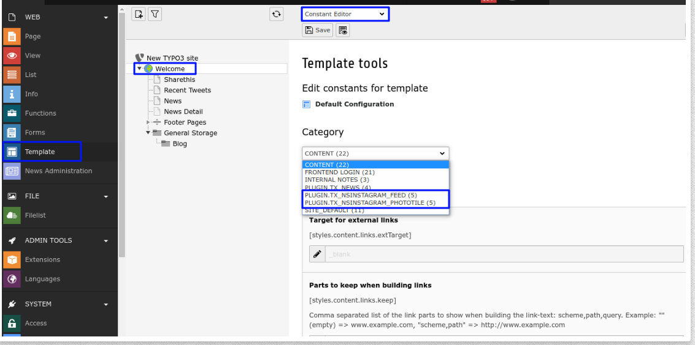
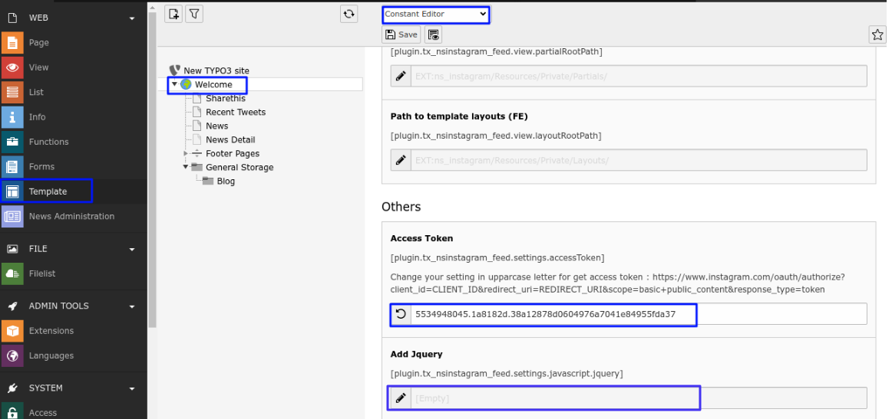
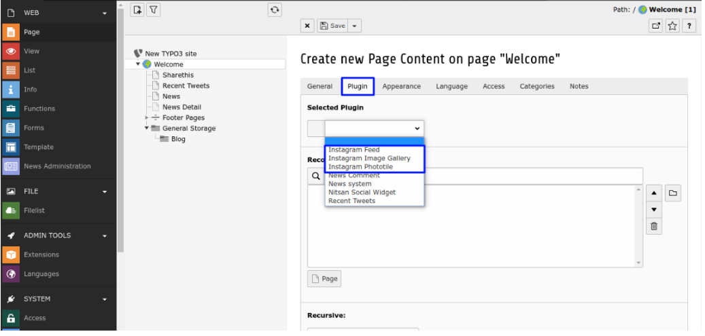
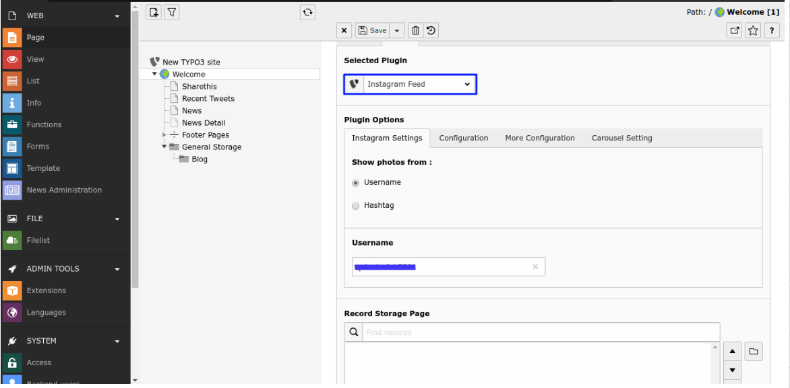
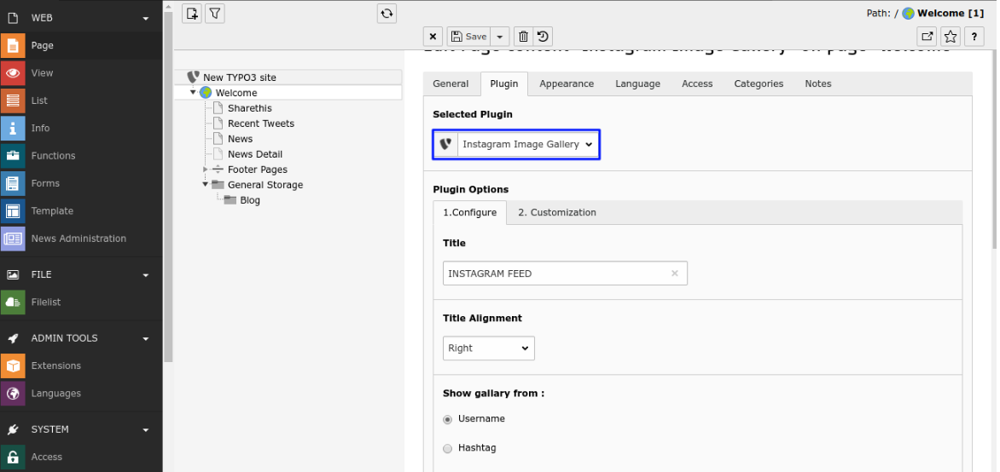
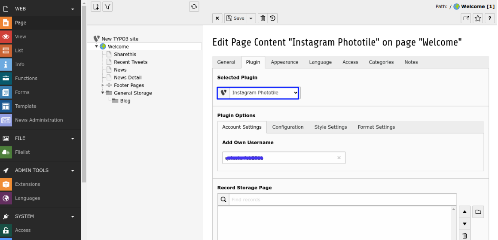

.. ==================================================
.. FOR YOUR INFORMATION
.. --------------------------------------------------
.. -*- coding: utf-8 -*- with BOM.

.. include:: ../../Includes.txt

.. _configuration:

Configuration
=============

Quick & Easy configuration of Instagram into TYPO3
----------------------------------------------------

#. Switch to the root page of your site.

#. Switch to the **Template module** and select *Constant Editor*.

#. Select Category = **PLUGIN.TX_NSINSTAGRAM_FEED (5)** And **PLUGIN.TX_NSINSTAGRAM_PHOTOTILE (5)**

#. Add **Access Token** and Add **Jquery (Optional)** in it.

#. Now Add plugin in to page where you want to show your Instagram Feeds. Checkout following Screen-Shots.

Clear Cache:
------------

Please clear cache from Top panel 'Flush frontend caches' & 'Flush general caches'. It will be also great to clear cache from Install tool too.