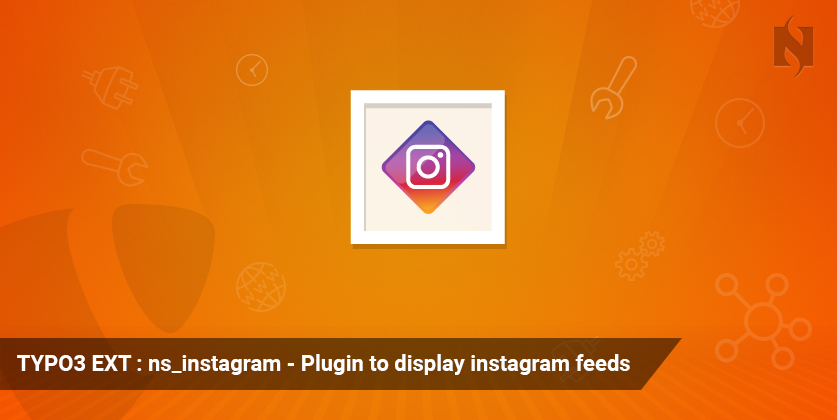
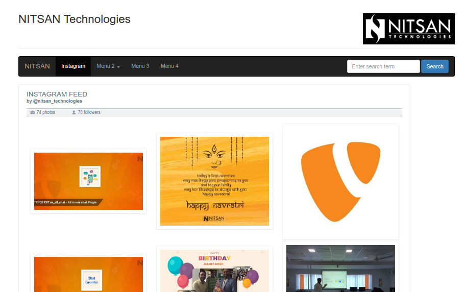
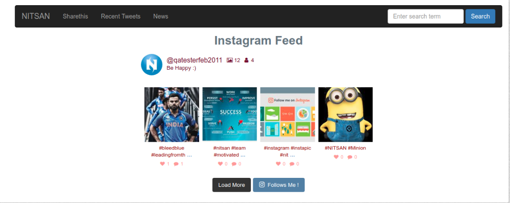
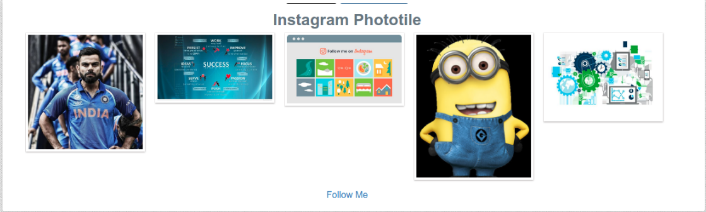

.. ==================================================
.. FOR YOUR INFORMATION
.. --------------------------------------------------
.. -*- coding: utf-8 -*- with BOM.

.. include:: ../Includes.txt

.. _screenshots:

What does it do?
================

Plugin to display gallery, feeds and phototile with clean, customizable and responsive feeds from multiple Instagram accounts.

It's awesome TYPO3 extension which provides you a very attractive frontend display of Instagram images in different view (eg., gallery, phototile) at your TYPO3 website.

Screenshots
============

**1. Instagram Gallery**
------------------------

**2. Instagram Feeds**
------------------------

**3. Instagram Phototile**
------------------------

